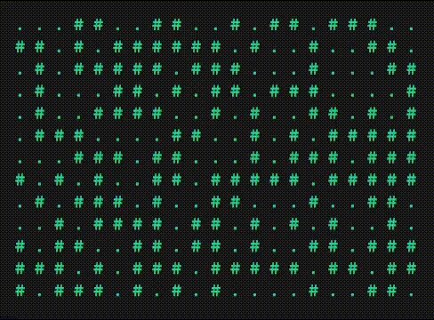

<br>

<h1 align="center">Juego de la Vida en Python</h1>
<p align="center">Conway's Game of Life</p>

<br>

Implementación en consola del **Juego de la Vida de Conway** escrita en Python puro, con entrada personalizada, múltiples modos de inicialización y visualización adaptable.

<br>

## ¿Qué es?

El Juego de la Vida es un **autómata celular** creado por el matemático John Conway. Es un juego sin jugadores, donde las celdas "viven" o "mueren" según reglas simples de evolución, generando patrones complejos y fascinantes.

<br>

## Funcionalidades

* Definición de **tamaño personalizado** del tablero (columnas y filas).
* Posibilidad de **rellenar el tablero**:
  * Aleatoriamente.
  * Manualmente.
  * Con estados predefinidos (esquinas o centro).
* Visualización en **modo texto** (estilos predeterminados o personalizados).
* Opción para controlar el **tiempo entre generaciones**.
* Corre en **consola** sin dependencias externas.

<br>

## Cómo usar

```bash
git clone https://github.com/angeldavidhurtado/the-game-of-life.git
cd  the-game-of-life
py el_juego_de_la_vida.py
```

<br>

## Resultado
<p align="center">
  
</p>

<br>
